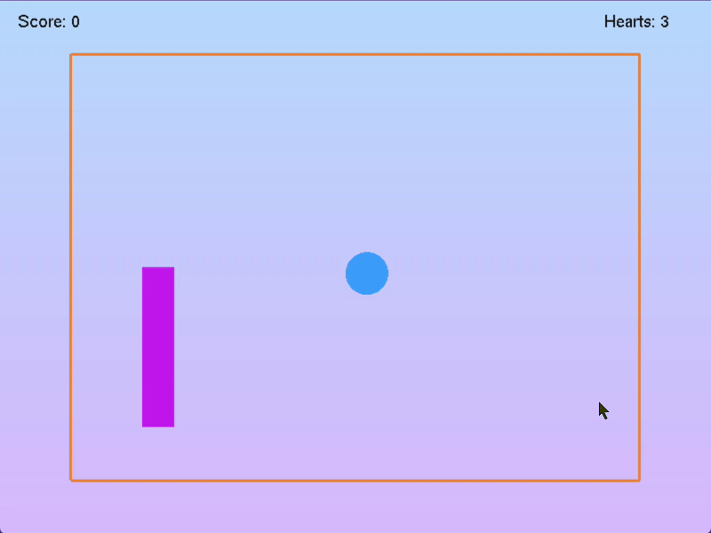

# PingPong Shader Game

A simple OpenGL based ping pong game using shaders, written in C++ with FreeGLUT and GLEW.
features:

- OpenGL advanced mode (shader based rendering)
- Mouse click to launch the ball towards a target
- Keyboard controls
- Score and remaining lives display
- Difficulty controls

## Screenshots

<p align="center">
  
</p>

## Controls

- **Arrow Up/Down**: Move the paddle up or down
- **Left Mouse Click**: Launch the ball towards the clicked position
- **Right Mouse Button**: Open menu (change difficulty, restart, exit)

## Build Instructions

### Prerequisites

- CMake
- FreeGLUT
- GLEW

### Windows

1.  ```powershell
    cmake --preset x64-debug
    cmake --build out/build/x64-debug
    ```
2.  Run the executable.

### Linux/macOS

- Use the CMake presets (`linux-debug`, `macos-debug`).

## File Structure

- `main.cpp` - Main game logic and rendering
- `vertex_shader.glsl` - Vertex shader source
- `fragment_shader.glsl` - Fragment shader source
- `libs/` - Prebuilt libraries and headers for GLEW and FreeGLUT
